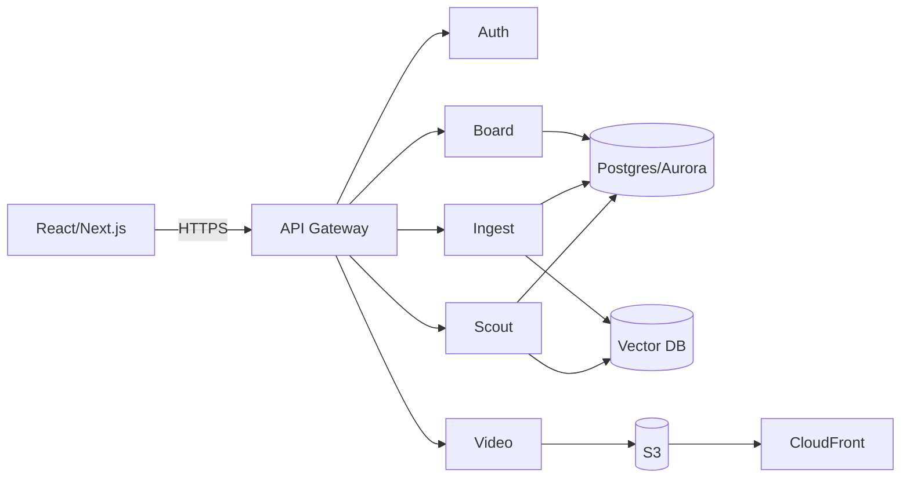

# Operationalizing Intelligence: A Commercialization Roadmap for PortalRecruit

## Executive Summary
The transfer portal and NIL era compress recruiting into a high‑frequency environment. PortalRecruit’s advantage is semantic search that converts coach‑speak into actionable, film‑backed candidates. The current prototype needs a full SaaS architecture, compliance posture, and data‑rights strategy to scale to D1 contracts.

## 1. Strategic Landscape
- **Portal window compression** → speed of evaluation is the edge.
- **NIL financialization** → recruiting mistakes now cost six figures.
- **Data disconnect** → Synergy/Sportradar are deep but rigid; PortalRecruit’s semantic layer is the differentiator.

## 2. Architecture Transformation (Target “Skout Cloud”)
### 2.1 Frontend
- Move from Streamlit to **React/Next.js** SPA.
- CDN delivery (CloudFront) for fast asset loads.
- PWA support for on‑road recruiting.

### 2.2 Backend Services (Microservice split)
- **Auth** (SSO + RBAC, university IT compliance)
- **Scout Service** (semantic search, metrics, tags)
- **Ingest Service** (async jobs + schedules)
- **Video Service** (secure clip delivery + transcoding)
- **Notes/Board Service** (recruiting boards, tags, collaboration)

### 2.3 Data Layer Migration
- SQLite → **Aurora PostgreSQL**
- Chroma → **Pinecone/Weaviate**
- Local video → **S3 + CloudFront**
- Session state → **Redis/ElastiCache**

### 2.4 Multi‑Tenancy
- **Row‑Level Security** (tenant_id) for strict isolation.

### 2.5 Infrastructure Diagram (Mermaid)


## 3. Productizing “Coach‑Speak”
### 3.1 Dog Index Definition
Combine deflections, loose balls, charge rate, contested rebounding with conference normalization.

**Proposed formula**
```
Dog Index = (w1*Deflections + w2*LooseBalls + w3*Charges + w4*ContestedReb%)
            / Possessions * LeagueAdjustment
```

### 3.2 Semantic Search
Fine‑tune SBERT on scouting reports. Use LLM to generate **explainable scout breakdowns**.

### 3.3 Transfer Translation Model
Train XGBoost to predict High‑Major outcomes based on Mid‑Major features. Output a “Translatability Score.”

**Candidate features**
- Usage rate, TS%, AST%, TOV%, ORB%, DRB%
- Strength of schedule
- Physicals (height/wingspan)

## 4. Video Intelligence (Future)
- Event detection (YOLOv11 / RF‑DETR)
- Tracking (SAM2 + OCR jersey ID)

## 5. Data Rights & Compliance
### 5.1 BYOL (Bring‑Your‑Own‑License)
- Customer authenticates with Synergy/Sportradar.
- PortalRecruit is a **processor**, not a distributor.
- Enables enterprise customers without resale rights overhead.

### 5.2 NCAA ECAG Certification
- Must provide **analysis**, not just raw data.
- Standardized pricing for all institutions.
- Application deadline: May 31 (annual).

## 6. Go‑To‑Market
### 6.1 Tiered Pricing
- Scout (D2/D3): $3.5k
- Personnel (Mid‑Major): $7.5k
- War Room (Power 5): $15k+

### 6.2 Target Buyer
Director of Player Personnel / Video Coordinator

## 7. 18‑Month Roadmap
### Phase 1 (0‑4 months)
- Containerize
- Aurora migration
- Basic Auth0
- Submit ECAG

### Phase 2 (5‑9 months)
- Pinecone deployment
- SBERT fine‑tune
- LLM scout breakdown
- Beta w/ 3–5 programs

### Phase 3 (10‑18 months)
- SaaS launch aligned to portal window
- Auto‑scaling infra
- Translation model
- CV‑powered metrics
